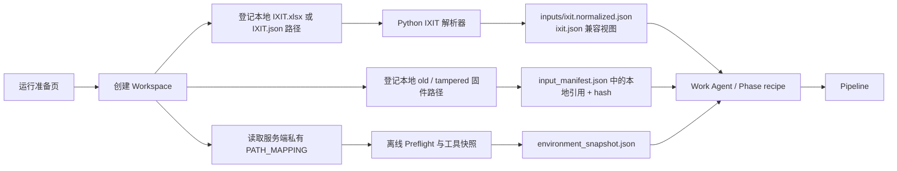

# B/S 运行准备层设计（保留 CC SDK 启动模式）

## 目标与边界

新增的 B/S 准备层服务于“创建一次可复核的检测运行”，不替代现有 CC SDK / CLI 文件式启动。CLI 仍可用既有 `PATH_MAPPING + workspace + ixit.json` 启动；Web 不上传、不复制用户原始 IXIT/XLSX 或固件，只登记工作机受控目录中的本地路径，计算 hash，并生成 Pipeline 所需的归一化 IXIT JSON。

浏览器不应上传文件字节，也不应提交任意服务器绝对路径。它只能提交处于服务端配置的 `INPUT_ROOTS` / `FIRMWARE_ROOTS`（或部署者私有 mapping 中对应目录）内的本地路径。API Key、Burp Token 和工具映射内容不得写入运行记录。每一个本地引用都必须保留来源文件名、路径、SHA-256、大小、登记时间和派生文件关系。

## 目标流程

## 前端信息架构

新增“运行准备”页，分四张卡片，按顺序解锁：

1. **工作区**：仅允许在 `AUTO_TEST_ROOT` 创建/选择；显示 workspace 状态，不能输入任意后端路径。
2. **工具映射**：默认只读显示服务端当前 `PATH_MAPPING` 来源和 preflight 结果。私有 mapping 由工作机启动环境指定，页面不上传、修改或回显整份 mapping。页面只显示逻辑来源、存在性与版本。
3. **检测输入**：填写位于 `INPUT_ROOTS`（或私有 mapping 的 `DIR.IXIT/DIR.INPUT`）内的 `IXIT.xlsx` 或合并 `IXIT.json` 本地路径。后端直接调用 `scripts/parse_ixit_xlsx.py` 或读取 JSON，工作区只生成 normalized JSON 和兼容 `ixit.json`，不复制原件。页面显示解析摘要、来源 hash 和派生 hash，不展示完整大表。
4. **固件与目标**：DUT IP 必填但只做格式校验，离线环境显示 `not_checked`；old/tampered 均填写位于 `FIRMWARE_ROOTS` 或私有 mapping `DIR.FIRMWARE` 内的本地路径，后端只登记路径、大小和 SHA-256，不复制固件。未提供样本时可继续，但 5.3/5.7 相关 recipe 必须转为 `PENDING_MANUAL`/`INCONCLUSIVE`，不得伪造 PASS。

“开始运行”只在输入快照与 preflight 已确认时可用。IP 可达性不是浏览器创建运行的前置条件；真机阶段由明确的 preflight/授权操作确认。

## 输入与 Agent 消费契约

Work Agent 不需要、也不应经前端读取 XLSX。它只消费由 Python 解析器生成的 workspace 文件：

| 产物 | 消费者 | 作用 |
|---|---|---|
| `inputs/ixit.normalized.json` | IXIT 检索工具、Work Agent | 多表命中检索与条款 recipe 对齐 |
| `ixit.json` | 现有 Pipeline | 向后兼容视图 |
| `inputs/input_manifest.json` 中的 `source_path` | M4/M5 recipe、固件分析脚本 | 受控工作机本地固件定位与 hash 取证；该路径不可移植 |
| `environment_snapshot.json` | receipt、报告 | 工具版本和映射解析事实 |
| `inputs/input_manifest.json` | 报告、审计 | 全部来源/派生关系与 hash |

页面展示“解析摘要 + manifest + 预检结果”即可；完整 IXIT 表应通过受限 IXIT 检索工具提供给 Agent，避免浏览器传输大表、避免 Agent 把上下文塞满。

## 与现有 CC SDK 的兼容

- 不修改 `skills/path-mapping.json`；现有 CLI 的 `PATH_MAPPING` 环境变量继续有效。
- Web 不改变 mapping；服务进程从环境读取私有 `PATH_MAPPING`，并从 `INPUT_ROOTS` / `FIRMWARE_ROOTS` 获得可引用目录。
- 本地 JSON/XLSX 二者最终都进入同一 normalized JSON 契约；浏览器上传旧路由明确返回拒绝，避免误用。
- 现有 `run_pipeline.py` 不要求知道浏览器；它只读取冻结后的 workspace 输入和 `run_config.json`。

## 分批实施与验收

**P1（已完成，私人电脑）**：运行准备页、workspace 创建、只读环境预检、本地 IXIT/固件引用、DUT IP 必填和显式“离线未验证”状态。

**P2（已完成，私人电脑）**：XLSX 本地引用直接复用 `scripts/parse_ixit_xlsx.py`；已验证表名识别、字段归一化、来源 hash、派生 JSON hash。解析失败不生成兼容 `ixit.json`，不同来源不覆盖既有 workspace 输入。

**P3（真机）**：私有 mapping 覆盖实际解析 tshark/xray；固件样本被 M4 recipe 成功发现；代理、抓包、Analyzer 与报告 receipt 形成闭环。

验收底线：任何未解析/缺样本/工具不可用的状态必须在 UI、run_config、evidence 和报告中一致地显示为阻塞、手工或不确定，不能由 UI 默认放行。
