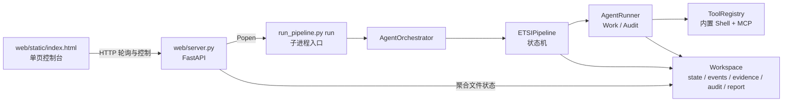

# ETSI Agent Framework 前后端重构与落地实施计划

> 历史实施计划与当前增量状态（原始重新审计版：2026-08-18；2026-09-14 更新公司部署状态）
> 适用仓库：当前 Git 仓库根目录
> 当前事实的阅读顺序：`README.md` → `docs/TRAFFIC_INTELLIGENCE_EASYTSHARK_INTEGRATION_PLAN.md` → 本文顶部“当前流量实现 / 实施进度”。下文保留历史发现、决策背景和待办，不能逐句当作当前能力声明。
> 当前限制：本公开仓库不保存公司环境的真机 DUT 测试材料。本阶段只维护、验证并清理可公开源码；不能把 mock、合成 PCAP 或公开仓库的历史 smoke 结果当成私有真机检测能力的替代品。

### 2026-09-14 工作环境实测状态（覆盖本文历史“待部署 / 待验收”措辞）

- 项目已在工作环境跑好，并已完成 **5 轮实际全量测试**。
- 原始 DUT 证据、PCAP、认证流量、凭据、环境路径和正式结果包均留在私有工作区，按公开边界不进入 GitHub。
- 因此，本文下方的“尚未部署”“等待内网”“真机 UAT 未完成”等历史记录，只描述当时的公开源码或本机状态，**不得再用来描述项目实际交付状态**。
- 公开仓库继续保留 Direct Tshark 默认回退和 A/B 基准，确保无私有 Worker 或私有证据时仍可安全复现框架行为。

### 2026-09-12 当前流量实现（覆盖下文历史 checklist 设计）

- 抓包交互固定为“开始 → 用户连续完成全部设备操作 → 完成”，不采集逐步骤勾选、人工标签或补录时间点。
- `tshark` 是帧级事实来源；Traffic Intelligence 先生成完整性受控的主 Bundle，EasyTshark 仅作为可选批处理 Worker，失败自动回退 Direct Tshark。
- `scripts/pcap_analyzer.py` 只保留为主 Bundle 成功后的最佳努力兼容输出；失败不阻断主流量阶段，也不得被 Work Agent 用来绕过主 Bundle 校验。
- 条款流量证据使用 `flowIds` / `frameNumbers` 结构化引用；报告优先从已校验 Bundle 解析并生成 PCAP 切片请求，旧 `pcap_analysis/_index.json` 仅在条款没有新式引用时兼容回退。
- UNKNOWN、高熵、无 TLS 不能直接证明私有协议语义或已加密；原始 PCAP、Payload、SQLite、私有 dissector、密钥和派生 Decode-As 目录均不得进入公开 Git。

### 实施进度

- [x] M1-M5 功能测试：已在工作环境完成。公开仓库只保留框架、匿名化资料和回归；真实 DUT 证据、PCAP、认证流量与凭据均保持在私有工作区，因此不能由公开仓库代替正式证据包。
- [x] A1 凭据基线：`.env.template` 已占位化，未创建或改动私人 `.env`，并增加回归测试。
- [x] A2 Python/依赖：Python 3.11.9 项目 `.venv`、`.[web,dev]`、Web 依赖和 CLI 安装入口已配置。
- [x] A3 CLI 退出码：结构化 error 或 run 未到 DONE 时返回非零退出码。
- [x] B1-B3 运行配置、输入与 Preflight：workspace 边界、离线 Preflight、不可变 IXIT 与 RunConfig 已落地。
- [x] E0 Skill 资产台账与 Phase 知识接线：`SKILL_ASSET_CONSUMPTION.md`、`framework/skill_asset_registry.json`、`knowledge_additions` 已落地；M6 派发模板已退役保留。
- [x] E1 条款目录与受限审计读取：68/68 canonical test-group recipe/条款速查/裁决对齐；Round 1/2 Audit 可只读检索 task 输入。
- [x] E2 概念性测试前置与 M0 闭环：权威 `qbfw_parsed.json` 的 62 条纯概念用例已生成 M0 目录；仅允许本地 `ixit_readonly` 多表检索。M0 必须经过 L1 → L2，且仅在 L2 ACCEPT 后写 `.audit_M0_ACCEPTED`；L2 每批最多 8 条后汇总。**已真实运行验证**（2026-08-20 全量 62/62、L1 PASS、L2 3 轮 REJECT、27 findings / 12 retry_targets、未签发 ACCEPTED）；本轮顺带修复输出上限截断、`read_ics_list` 全量读 ICS、逐条 checkpoint 归档，见 `experiments/2026-08-20-m0-concept-62/`。
- [x] E2-R 概念性定点打回：L2 REJECT 持久记录 retry round、目标条款、理由和新旧 evidence hash；仅重做目标概念条款，保留未命中 evidence，并在最多两次重试内重走 L1 → L2。**已真实运行验证**（3 轮审计 retry_count=2 均按定点返工闭环）；但**仍存在审计/证据质量问题**（ICS/IXIT 矛盾，如"自动更新声称 vs IXIT 全 Manual"），需在收紧证据后下轮复核。
- [ ] F1 功能性审计重试与 PhaseEngine 收敛：现有 M1-M5 `_retry_work_for_clauses()` 会绕开 PhaseEngine 直接重写 `pre-Mx-evidence.json`，与 phase 受限工具、正式归档和证据合并原则冲突。该问题已登记，**本轮不改功能性执行**；后续必须将功能性定点重做改为 PhaseEngine 的受控重执行，而非复用现有直接写文件路径。
- [x] E3 执行收据与最小执行边界：Agent Tool-Use、Traffic 系统工具均写原子 receipt；工作区、DUT 目标与明显危险脚本受策略约束；报告/条款证据包可索引收据与产物引用。
- [x] H1 Traffic 交互核心：后端状态机驱动开始/完成/跳过门禁；正式操作窗是单段连续无标签采集，不要求逐项复选或人工标注。
- [x] C1 RunManager 基线：命令、白名单环境、启动日志句柄、注册表原子持久化与安全 reconcile 已从路由提取为 `web/run_manager.py`。
- [x] B/S 准备页 P1/P2：受控 workspace 创建、离线 preflight、IXIT JSON/XLSX 与 old/tampered 固件本地引用已接入控制台；浏览器不上传字节，IXIT 复用现有 `scripts/parse_ixit_xlsx.py` 生成 Agent 消费的归一化 JSON，manifest 记录来源路径与 hash。
- [x] H2 运行管理收尾：终态 run 可只移除 `.runs.json` 登记且保留全部 workspace 产物；取消过程以“请求 → Traffic 清理 → Burp 恢复 → Pipeline 取消终态”公开显示；`resume` 保持未开放。
- [x] 内网真机验收包：新增 `真机迁移验收包/`，含私有环境变量模板、迁移/Traffic/停止验收步骤和由当前 catalog 生成 full/partial 条款表的脚本。
- [ ] C 仍为部分落地；D、F1-F3 与 G 的证据包/HTML 离线实现已完成；H 的完整交互收敛和真机验收仍见本文后续阶段。
- [ ] 断网重连 resume（暂停/续跑，真机阶段确认的需求）：断网或瞬时错误后应可「暂停等待恢复」而非直接进终态。落地前提待做：PhaseEngine 阶段幂等、Traffic 旧抓包/旧 Burp 状态恢复、M1-M5 evidence hash 跳过规则（见 C2/F1）。未落地前维持「失败即新 workspace、不 resume」。

当前回归基线：Traffic Intelligence、报告、契约及相关回归测试已通过；2026-09-12 完整离线套件为 **286 passed、3 skipped、4 failed**。4 个旧 MCP 测试仅因当前隔离测试依赖缺少 Windows `pywintypes` 而在导入期失败。合成 PCAP 不含真实设备数据或 Payload。

### 2026-08-20 M0 概念全量运行遗留待做

- [ ] 端到端 checkpoint 断点续跑回归：故意在中途条款注入失败，验证重跑复用 `evidence/checkpoints/M0/concepts/` 有效 checkpoint、只补缺失条款（当前仅单测级验证）。
- [ ] 全量 62 条重跑并落地新 evidence：中文输出指令 + `read_ics_list` + 折叠展示 + checkpoint 已就位，但尚未用新代码重跑 62 条并重新生成 panorama（当前 `experiments/2026-08-20-m0-concept-62/` 的 evidence 仍为部分修复前产物）。
- [ ] 27 条 ICS/IXIT 矛盾 finding 的处置：属厂商文档质量问题（如"自动更新声称 vs IXIT 全 Manual"），非框架缺陷，待厂商改文档或重定 scope 后再复核。

---

## 1. 结论先行

当前项目已经具备一个可运行的 Web MVP：FastAPI 能启动 Pipeline 子进程，前端能轮询状态、显示 M0-M5 Agent、在 Traffic 阶段发送完成/跳过信号，并展示结构化报告。但它还不适合直接作为正式认证检测控制台，原因不在“页面不够漂亮”，而在以下闭环尚未建立：

1. **运行环境闭环仍需部署验证**：Python 3.11.9 项目 `.venv` 与 Web 依赖已配置；但其他工作机的安装、入口和版本锁定仍需按 A 阶段复核。
2. **凭据与配置边界不安全**：`.env.template` 中出现真实形态的 API Key；Burp Token 通过命令行并回传到 API 响应；浏览器可提交任意 workspace 路径。
3. **Traffic 离线状态机已落地，真机仍待验收**：`traffic_state.json` 已记录“通道就绪 → 用户开始连续操作 → 完成/清理 → Traffic Intelligence 分析”；但尚未在可达内网 DUT 上验证真实双通道、Burp 恢复和 PCAP 质量。
4. **失败语义可能失真**：tshark/xray 全不可用时 Traffic 阶段直接返回，Pipeline 仍继续；M1-M5 持续审计失败时存在阶段级循环；Round-2 跨模块审计无条件签发接受令牌。
5. **条款静态对齐和基础执行收据已建立，但真机 UAT 尚未闭环**：67 条均已有 recipe、IXIT 表导航、证据产物与三态 oracle；recipe 已注入当前 Work task。每次受 `ToolRegistry` 管理的调用及 Traffic 核心工具已记录 receipt；仍缺可达 DUT 上的逐条执行、人工操作确认和第三方复现证明。
6. **前后端数据契约仍是“从文件猜状态”**：后端通过反复读取整份 JSONL、推断 Traffic 是否等待；前端硬编码阶段并漏掉 `m0_audit`；运行恢复只恢复 Pipeline 快照，不等于阶段级幂等恢复。
7. **报告产物已同源，遗留拼装代码待清理**：`framework/reporting.py` 已成为 Markdown、Web、独立 HTML、条款证据包和下载的统一数据源；`ReportGenerationStage` 中的旧 Markdown 拼装路径保留为短期兼容代码，但其文件输出已由统一 renderer 覆盖，后续仅在有完整比较测试后删除。

因此，下一步应先把**配置、安全、状态与证据契约**做稳，再扩展 UI。不能先做“路径映射输入框”或“审计失败自动 ACCEPT 放行”这类表面功能。

---

## 2. 当前代码架构事实

### 2.1 运行链路



| 层 | 当前文件 | 已有能力 | 主要缺口 |
|---|---|---|---|
| 前端 | `web/static/index.html` | 启动 run、轮询、Traffic 按钮、模块/Agent/报告展示 | 阶段硬编码且漏 `m0_audit`；操作状态不持久；无停止/恢复 |
| Web API | `web/server.py` | 子进程启动、状态聚合、Traffic 信号、事件、报告、文件读取 | 路径与密钥治理、状态语义、输入导入、接口测试不足 |
| CLI | `run_pipeline.py` | 注册 Pipeline、连接 MCP、运行 Agent、查询工作区 | 内部错误可返回 JSON error 但进程仍 exit 0；包入口失效 |
| Pipeline | `framework/pipeline.py`、`pipelines/etsi/pipeline.py` | 快照恢复、阶段/闸门、M0 审计、Traffic、M1-M5、报告 | 阶段幂等性不足；Traffic/审计失败语义不严 |
| Agent/Tool | `framework/agent_runner.py`、`tools.py`、`mcp_client.py` | Prompt 隔离、多轮工具调用、MCP 动态发现 | 工具执行无 workspace/target 约束；条款到工具不可验证 |
| Skill/规则 | `skills/`、`framework/clause_tool_map.json` | 条款参考、裁决规则、证据 schema、67 条 recipe | 需继续验证每个 recipe 的实际工具 receipt；`SKILL.md` 不是 Agent 自动加载项 |
| 报告 | `framework/reporting.py`、`ReportGenerationStage`、`_query_report_data` | 同源 JSON/Markdown/HTML、条款证据包、范围下载 | `ReportGenerationStage` 的旧拼装代码待有比较测试后清理 |

### 2.2 Pipeline 实际状态机

```text
INIT → ENV_CHECK → ICS_PARSE → M0_ICS → M0_CONCEPT(62) → M0_L1 → M0_AUDIT(8/批) → TRAFFIC
     → M1_M5 → CROSS → REPORT → DONE
```

已落地：M0 使用 `.audit_M0_ACCEPTED`；Traffic web 模式轮询 `traffic_user_done/skip`；M1-M5 使用 PhaseEngine；Telemetry 写 `events.jsonl`；报告已过滤 phase 中间 evidence。

必须纠正的理解：

- `pipeline_state.json` 能恢复当前阶段，但阶段中断后会重跑整个阶段，不是完整幂等续跑。
- Work Agent 不会自动“调用整个 SKILL”。实际注入的是 persona、`knowledge_paths`、ammo、task 和 recipe；`SKILL.md` 是编排规范。
- `PATH_MAPPING` 的值是**映射 JSON 文件路径**，不是 JSON 内容或 exe 路径。

---

## 3. 审计发现与优先级

### 3.1 P0：动其他功能前必须处理

| 编号 | 发现 | 风险 | 正确处理 |
|---|---|---|---|
| P0-01 | `.env.template` 含真实形态 API Key | 凭据泄露 | 立即撤销/轮换；模板恢复占位符；检查 Git 历史与日志 |
| P0-02 | Burp Token 进入 CLI 参数且 API 返回 command | 进程列表/API/日志泄露 | 仅通过子进程 env；响应、日志、`.runs.json` 全部脱敏 |
| P0-03 | workspace 可为任意绝对路径并自动创建 | 越权写目录 | 配置 `AUTO_TEST_ROOT`，resolve 后必须位于根目录 |
| P0-04 | Web 依赖未声明，脚本入口指向不存在模块 | 无法重复安装 | 增加 web optional dependencies；修复 `framework.cli` 入口 |
| P0-05 | CLI 内部失败仍可能 exit 0 | UI 将失败显示为完成 | `main()` 按结果状态非零退出；非 DONE 同样失败 |
| P0-06 | 私人电脑的 Python 3.11 未被旧 `py` launcher 识别 | 常规 `py -3.11` 误报不可用 | 已使用现有 Python 3.11.9 建立项目 `.venv`；后续统一调用 `.venv` |

### 3.2 P1：认证结果正确性的核心缺口

- Traffic 双工具不可用时直接继续，可能形成无流量证据的“完整”报告。
- Traffic 无 start 操作窗，无法区分预热流量与正式用户操作流量。
- M1-M5 gate 持续失败时会重复进入整个阶段。
- Round-2 无条件创建 `.audit_ROUND2_ACCEPTED`。
- `FLAGGED` 与 `.audit_*_ACCEPTED` 混用，名称与事实冲突。
- 67 条款中仅 53 个进入 `clause_tool_map.json`；14 个没有 recipe。
- 23 个 full 中 6 个没有工具声明：5.5-6、5.5-7、5.5-8、5.8-1、5.9-3、6-4。
- recipe 只显式展开 Burp 工具，bash/Playwright 信息未完整注入。
- Shell/read/write 工具不限制 workspace 和授权 DUT。
- Web 启动时直接修改 `ixit.json` 写 DUT IP，破坏原始输入可追溯性。

### 3.3 P2：可维护性与体验

- 前端阶段表漏 `m0_audit`，应由后端动态返回。
- Traffic 操作状态必须以工作区状态文件为单一事实源，不能只存在于页面 DOM（已由连续无标签状态机解决）。
- `/events` 每次读完整 JSONL，长期运行退化。
- `_runs` 的 Popen 仅在内存，Server 重启后状态失真。
- 没有 stop/cancel；关闭网页不会停止 Pipeline 与工具。
- `/file` 缺 artifact allowlist 与大小限制。
- wildcard CORS 对本机控制台无必要；若绑定局域网又缺认证。
- Markdown 报告仍以纯文本查看，没有独立可归档 HTML。

---

## 4. 目标原则与目录

原则：工具映射属于部署环境，不进浏览器；输入文件不可变；状态显式；ACCEPT token 只代表 ACCEPT；每条款可追溯到步骤/工具/evidence/oracle；mock 只验证编排；离线契约验证不能替代真机 UAT。

建议逐步演进：

```text
web/api/                    # runs / traffic / reports / environment
web/services/               # run_manager / state_reader
framework/runtime_config.py
framework/reporting.py
framework/clause_catalog.py
framework/execution_policy.py

workspace/
  inputs/                   # 原始 ICS/IXIT，不可变
  run_config.json           # 无 secret 的覆盖配置
  environment_snapshot.json
  traffic_state.json
  pipeline_state.json
  evidence/
  audit-results/
  reports/                  # json + md + html
```

先提取 service，再瘦身 `web/server.py`，不要求一次性重排所有目录。

---

## 5. 分阶段实施计划

## 阶段 A：可重复环境与安全基线（私人电脑可完成，P0）

### A1. 凭据处置

1. 在供应商控制台撤销并轮换模板中暴露的 Key。
2. `.env.template` 改回占位符。
3. 确保 `.env`、`web/.runs.json`、workspace、运行日志不进 Git。
4. 增加离线 secret 扫描测试，检查 API Key、Bearer、Token 模式。

验收：仓库与 API 响应不出现有效凭据，启动命令不包含 Burp Token。

### A2. Python 与依赖

`pyproject.toml` 增加：

```toml
[project.optional-dependencies]
web = ["fastapi>=0.115", "uvicorn[standard]>=0.30"]
```

修复 `etsi-framework = "framework.cli:main"`：增加薄封装或改成真实入口；`web.server` 增加可导入 `main()`。

安装 Python 后执行：

```powershell
cd <repository-root>
py -3.11 -m venv .venv
.\.venv\Scripts\Activate.ps1
python -m pip install --upgrade pip
python -m pip install -e ".[web,dev]"
$env:PYTHONIOENCODING = "utf-8"
python -m pytest tests -q
```

已完成环境配置：项目 `.venv` 使用 Python 3.11.9，已安装 `.[web,dev]`；FastAPI 0.141.1、uvicorn 0.52.3、Pydantic 2.13.4 可正常导入。全量离线测试结果为 `101 passed, 3 skipped`，Web `/api/health` 返回 200，安装后的 `etsi-framework --help` 可正常运行。旧 `py` launcher 仍可能无法识别该解释器，因此后续命令统一使用 `.\.venv\Scripts\python.exe` 或先激活 `.venv`。

### A3. CLI 失败退出码

- `_run_pipeline` 可返回结构化 error，但 `main()` 必须按 status `sys.exit(1)`。
- Pipeline 最终状态不是 DONE 也非零退出。
- Web 用 exit code 与 `pipeline_state.current_state` 联合判断 succeeded/failed。

---

## 阶段 B：运行配置、输入与 Preflight（私人电脑可完成）

### B1. 工具映射边界

**不得修改 `skills/path-mapping.json`。** Server 启动时从自身环境读取 `PATH_MAPPING`，其值为本机映射 JSON 路径。私人电脑可用仓库外 `%LOCALAPPDATA%\etsi-agent\path-mapping.private.json`；临时验证才使用不提交的 `scratch/path_mapping_local.json`。

前端只展示工具逻辑名、解析来源、是否存在和版本，不提供任意路径编辑框；浏览器也不能传 `PATH_MAPPING` 给子进程。

### B2. 只读 Preflight

新增 `GET /api/environment` 或 `POST /api/preflight`，返回并保存：

- Python/项目/平台版本；
- PATH_MAPPING 是否配置、文件是否可解析；
- nmap/tshark/xray/curl 等 resolved path、exists、version；
- Burp/Playwright MCP connected 和实际发现工具；
- DUT 格式与 reachable 状态（当前应是 `unreachable/not_checked`）；
- `offline_ready`、`traffic_ready`、`full_device_ready`。

快照写 `environment_snapshot.json`，报告引用它。

### B3. 输入与 RunConfig

新增：

- `POST /api/workspaces`：只在 `AUTO_TEST_ROOT` 下建目录；
- `POST /api/workspaces/{id}/inputs`：导入 ICS/IXIT，校验类型/大小/schema，计算 SHA-256；
- `POST /api/runs`：只收 workspace id、pipeline、DUT override、功能开关。

DUT/Burp 等非 secret 配置写 `run_config.json`；Traffic 使用“run_config override > IXIT declaration”，但报告展示两者差异。禁止改写原始 IXIT。

---

## 阶段 C：RunManager 与 API（私人电脑可完成）

### C1. 生命周期服务

从 `web/server.py` 提取 `RunManager`：`build_command/build_env/start/stop/resume/reconcile`。argv 不用 shell；env 白名单；secret 不持久化；Popen 后关闭父进程日志句柄。

Run 状态固定为：

```text
created | preflight_blocked | running | waiting_user | stopping |
succeeded | failed | needs_review | cancelled | orphaned
```

Server 重启后通过 PID、创建时间、run manifest reconcile，不能只看内存 Popen。

**已落地（RunManager 基线）**：`web/run_manager.py` 统一负责 argv 构建、白名单子进程环境、父进程日志句柄关闭、运行注册表原子持久化和 reconcile；`web/server.py` 路由仅保留 HTTP 校验与调用。白名单保留 `ANTHROPIC_API_KEY` 等本机 LLM 配置以及 `PATH_MAPPING`，不持久化 Burp Token，也不会把任意父进程环境变量泄入子进程。当前服务持有 `Popen` 时可准确取得 exit code 与 `succeeded/needs_review/failed` 终态。服务重启后若旧 PID 似乎仍存在，则只显示为 `orphaned`，不假装重新托管、更不按 PID 自动终止，避免 PID 复用误杀。

### C2. 停止与恢复边界

- `POST /api/runs/{id}/stop`：只发 cancellation，在安全点清理；不按 PID 强杀。
- 不提供 `POST /api/runs/{id}/resume`。恢复运行必须先定义 Traffic 旧抓包/旧 Burp 状态、M1-M5 evidence hash 跳过与必须重跑的边界，否则会污染证据链。

未来若开放恢复，每个 Stage/phase 必须先写 attempt id 与产物 manifest；Traffic 必须检查旧 PID 和 Burp 状态；M1-M5 必须定义 hash 合法的跳过规则；报告必须可重复生成且不重复。

**仍未开放的部分**：不提供直接 terminate/PID 强杀；这可能绕过 Traffic 的 Burp/子进程清理。必须在协作式取消超时且确认清理策略后，才讨论升级终止与 resume。

**已补充（H2 安全取消）**：`POST /api/runs/{id}/stop` 只写 `tokens/.cancel_requested`，从不按 PID 强杀；Pipeline 在每个 Stage 开始前及执行后的安全点确认取消。Traffic 等待用户操作时也会消费该 token，随后走 xray/tshark/Burp 清理逻辑并以 `cancelled` 终态退出。前端按真实 `traffic_state.json` history 显示“已请求取消 → Traffic 清理 → Burp 恢复 → Pipeline 终态”，不会把请求错误显示为完成。同一 workspace 不允许创建第二个活动 run，防止取消 token 与证据状态串扰。M1-M5 单个 Agent 调用内部的可中断性与超时升级终止仍是后续工作。

### C3. Web 安全

- 默认仅 `127.0.0.1`，移除 wildcard CORS。
- 若未来局域网访问，另开配置并增加 token、Origin/CSRF 校验与 TLS 反代。
- `/file` 改为 artifact id，限制类型和大小。
- Traffic action 必须验证 run、Pipeline state 和 Traffic state。

**已落地（本机边界）**：FastAPI 已移除 `allow_origins=["*"]`；静态控制台和 API 同源运行于本机回环地址，不再向任意 Origin 授权读取。报告与主模块 evidence 已通过受控 artifact-id 公开：不再接受任意 `path`，仅允许已登记的主 evidence、Markdown 和独立 HTML 报告；文本预览限制为 2 MiB，HTML 仅作为归档视图响应。未来如需局域网访问，必须先新增显式 Origin 白名单、访问 token、CSRF/Origin 校验与 TLS 反代，不能恢复通配 CORS；其他原始大证据继续仅通过按条款构建的下载包提供。

---

## 阶段 D：阶段 3.1 显式交互状态机（主体可离线，真机终验）

### D1. 状态与 action

```text
PREPARING → CHANNELS_READY → WAITING_START → COLLECTING
          → WAITING_FINISH → STOPPING → ANALYZING → COMPLETE

异常：BLOCKED / SKIPPED / CANCELLED / FAILED
```

action：

- `start_operation`：用户确认环境就绪，记录正式操作窗口开始；
- `check_item`：保存 done/N/A、时间、备注和证据；
- `finish_operation`：停 xray、停 tshark、分析 pcap、恢复 Burp；
- `skip`：必须写原因并进入 needs_review，不能当成功；
- `cancel`：清理后终止。

可保留 token 作为唤醒信号，但 `traffic_state.json` 才是事实源。

**已落地（离线）**：`framework/traffic_state.py` 原子写入工作区 `traffic_state.json`；Web 只有在 `WAITING_START` 才能发送 `start`，只有在 `WAITING_FINISH` 且所有必做项已记录后才能 `done`，`skip` 强制填写原因。控制 token 扩展为 `traffic_user_start|done|skip`，只用于唤醒独立 Pipeline 子进程。旧 attempt 在 Pipeline 重入时记为 interrupted，绝不假装可重新接管已丢失的进程句柄。

### D2. 连续无标签操作窗（取代历史 Checklist 设计）

不再让操作者逐项勾选、分步骤打标签或补时间点。Pipeline 与 Web 只保留开始、完成、跳过三类控制动作；开始与完成之间的全部设备操作属于同一个连续正式采集窗口。

old/tampered 固件、音视频、表单等业务归属由后续自动活动窗口、Flow、Burp history 和条款工具证据关联；没有足够归属证据时必须判 INCONCLUSIVE，不得要求操作者回填标签来制造确定性。

**已落地（离线）**：`traffic_checklist.json` 只保留单个连续操作窗的说明性元数据；状态与报告不再展示逐步骤完成记录。前端在 `WAITING_START` 允许开始，在 `WAITING_FINISH` 允许直接完成。

### D3. 清理保证与离线 fake

Traffic 使用 `try/finally`，任何异常都尝试停 xray、停 tshark并 flush、恢复 Burp、记录残留 PID。失败则 blocked/needs_review。

离线实现 fake tshark、fake xray、fake Burp adapter、fake analyzer，验证完整状态机和异常清理。fake 只证明控制流，不证明条款 PASS。

**已落地（离线）**：`TrafficCollectStage` 使用 `try/finally`；正常结束与异常/跳过均尝试按 xray → tshark → Burp 恢复清理。双通道任一未就绪、PCAP 缺失/过小、分析失败或 skip 均落为 `BLOCKED`/`FAILED`/`SKIPPED` 并令 Pipeline 进入 `needs_review`，不会作为正式认证通过。fake 测试覆盖开始前 done 无效、清单闸门、skip 原因、持久化重入留痕及正常清理顺序；这些只证明控制流，不证明真机条款 PASS。

---

## 阶段 E：条款—Skill—工具—Evidence 全链路

### E0. Skill 资产消费者台账（已完成）

已建立两份同源基线：

- `SKILL_ASSET_CONSUMPTION.md`：供开发者阅读的“资产 → 消费者 → 边界 → 保留/退役”说明；
- `framework/skill_asset_registry.json`：机器可校验的全量登记表；测试保证 `skills/` 下每个文件均有状态、消费者和范围说明。

处理原则：检测 skill 按 Work 公共、模块 ammo、Phase 条件知识和编排契约拆分；审计资料只给 Audit Agent；现有 exploit ammo 保持原有窄范围，不新增攻击面；`m6-agent-prompt.md` 退役但不删除。

同时已接通 `PhaseDef.knowledge_additions`：只接受相对 `skills/` 的受限文件路径，拒绝绝对路径与目录穿越。M1 的 VM 扫描、M2/M3 的前端加密、M3/M4/M5 的 pcap 查询资料按 Phase 挂载。`capability-matrix.md` 已进入 Work 公共知识。

### E0.1 对齐基线（已完成，已收敛）

`scripts/validate_clause_alignment.py` 已将模块、Phase、`clause_tool_map.json`、条款速查表和裁决表进行只读对齐检查。当前报告的真实缺口必须保留可见，不能用 mock 掩盖：

- 规范测试组、recipe 与 Phase：68/68 已对齐；
- M0 概念执行面：qbfw 62/62 纯概念用例已导入；
- M1-M5 功能执行面：qbfw 47/47 功能或混合测试组已保留；
- 所有 full recipe 均已声明至少一种允许工具；6 个仅靠既有 pcap/IXIT 产物的旧条目已降为 partial，并写明输入产物与 INCONCLUSIVE 边界。

该脚本默认只输出 JSON；E1 已收敛，`--strict` 已可作为 CI 阻断。

### E1. 67 条款目录

把 `clause_tool_map.json` 升级为可校验 catalog。每条必须有：module、automation、prerequisites、steps、required_tools、evidence_requirements、pass/fail/inconclusive oracle、safety、fallback。

M4 更新机制首批：5.3-3、5.3-4、5.3-5、5.3-7、5.3-8、5.3-11、5.3-12；概念性测试收敛批：M1 的 5.6-6~9、M3 的 5.5-3、M5 的 5.2-2~3，均已具备 IXIT 表导航、先决条件、允许工具、证据产物、三态 oracle 与人工边界，并由 `build_clause_recipe_text()` 注入 Work Agent 当前任务。

目录完整不等于已在真机上证明合规：每条 recipe 仍必须按其策略执行确定性 IXIT parser、工具行为证据或 partial/manual 路径；信息不足时只能输出 INCONCLUSIVE。

已复核原先 6 个 full 无工具项：需要真实业务流量或语义判断的条款降为 partial；其余 recipe 继续以声明的工具、输入产物和三态 oracle 执行。

### E2. Recipe 与 Skill 注入

`build_clause_recipe_text()` 必须同时输出 bash、Burp、Playwright、scripts、prerequisites、evidence requirements、三态 oracle 与安全确认。Agent 只拿当前 phase recipe，不在整个 Skill 中自由猜。

将 PipelineDef 知识拆为 work shared、audit shared、audit only、work ammo；去除重复 `verdict-criteria.md`。PhaseEngine/Pipeline 统一调用 `build_work_config/build_audit_config`，不再手拼 AgentConfig。

`SKILL.md` 继续是编排规范；运行时需要的规则必须在明确 reference 中并由配置加载。文件夹存在不代表 Agent 自动使用。

### E3. Tool receipt 与执行边界

每次工具调用记录 run/module/clause/phase/attempt、工具版本、脱敏参数、授权 target、起止/exit code、stdout/stderr artifact hash、错误分类及 evidence 引用。

`read_file/write_file` 必须限制 workspace；shell 命令经 execution policy 校验 DUT/网段；破坏性 recipe 要前端确认；`python_script` 使用 `sys.executable`。

**已落地（第一、二层）**：`framework/tool_receipts.py` 以每次调用一个原子 JSON 的方式写入 `tool-receipts/`。Agent 多轮 Tool-Use 经 `ToolRegistry.execute()` 自动附带 workspace、module、phase、phase 条款范围与 attempt；参数和返回值保存 SHA-256 与脱敏预览，不写 token/password/Authorization 明文。`TrafficCollectStage` 的 tshark/xray 启停、Traffic Intelligence 主分析及兼容 `pcap_analyzer` 同样写入阶段级收据（`TRAFFIC / 3.1`），但不伪造子条款归属。

`ToolExecutionPolicy` 已在有 workspace 上下文的调用前执行：`read_file/write_file` 只能在工作区内；网络目标只能为 `run_config.json` 声明的 `dut_ip` 或 `authorized_targets`；明显破坏性 shell、管道下载执行和危险 `python_script` 会被拒绝。允许/拒绝决定写入同一 receipt。工具版本只复用 `environment_snapshot.json` 已记录的值，未记录即明确写 `not_recorded`，不以隐式探测伪造环境事实。成功的 `write_file` 与 Traffic 的 `capture.pcap`、`xray_run.log`、`pcap_analysis` 会写入 `artifact_refs`；报告构建按显式 `clause_ids` 把 phase receipt 链接到对应条款证据包，阶段级无条款收据只计入总数。

**边界仍然存在**：这不是完整 shell 沙箱，尚不支持 CIDR 网段授权；receipt 不复制未脱敏 stdout/stderr，原始 Nmap/PCAP/Burp 等仍必须由 `evidence.path` 或 `artifact_refs` 指向；未经过 `ToolRegistry` 的未来子进程仍需逐一纳入；错误分类和前端高危操作确认仍属后续 H/真机验收范围。

### E4. 静态测试

1. modules 的 67 条款与 catalog 完全一致；
2. full 必须有 executable step 或 deterministic parser；
3. script/ref 文件存在；
4. MCP 工具名可解析；
5. 每条有 evidence requirements 和三态 oracle；
6. Work 不加载 audit-only；
7. recipe 覆盖全部工具类别；
8. manual/destructive 不会无确认执行。

完成 E 后可以回答：“每个模块条款都能索引到 skill 对齐的 recipe、工具类别、IXIT 表位与裁决边界。”但不能回答“全部已在真机跑好”；该结论必须等待 Tool receipt 与逐条真机 UAT。

---

## 阶段 F：审计和 Gate 正确性（私人电脑可完成）

### F0. 审计输入可读性（已完成）

Round 1 与 Round 2 Audit 现在通过 `framework/audit_tools.py` 获得 `read_audit_input`、`search_audit_input` 两项能力：只允许读取本轮 task 明列的相对工作区输入（IXIT、evidence、Round-1 审计结果），支持分段读取和关键词定位。没有 shell、MCP、写文件或工作区外读取能力；相对路径逃逸已由单元测试覆盖。

### F1. 重试上限

已复核根因：`M1M5ParallelStage` 内部虽有 `MAX_WORK_RETRIES=2` 和 `MAX_AUDIT_RETRIES=2`，但某模块耗尽后不会发 `.audit_Mx_ACCEPTED`；`M1_M5_PARALLEL → CROSS_MODULE_AUDIT` 的 `PhaseGate` 随即失败并按 `on_failure=M1_M5_PARALLEL` 重进整个阶段，因此内部计数每次重建，形成阶段级无限循环。M0 审计 gate 同样存在回到 M0 的潜在循环，不能只修一个 token 名称。

**已落地**：`PipelineSnapshot` 持久化 `gate_failures`、`review_required` 和 `review_reasons`；自循环 transition 可设 `max_gate_failures`。M1-M5 模块内耗尽后只允许阶段层再进入一次，仍缺审计令牌则生成带“不完整/待复核”标识的部分报告并以 `needs_review` 终态退出（CLI 非零）；M0 审计耗尽则直接 `failed`。没有补 `.audit_Mx_ACCEPTED`，也没有把部分报告伪装成认证成功。Web 状态 API 同步返回复核原因；状态机测试覆盖两种终态。

后续只需在恢复/指定模块重跑功能落地时，显式清理已批准模块的 gate 计数和相关 token；不得在普通页面刷新或进程重启时隐式清理。

### F2. Token 语义

**已落地**：审计结果由 `framework/audit_tokens.py` 统一记录为互斥 token：

```text
.audit_Mx_ACCEPTED
.audit_Mx_REVIEW_REQUIRED
.audit_Mx_REJECTED
.audit_Mx_ERROR
```

`.audit_Mx_ACCEPTED` 是唯一 Gate 通行凭证。FLAGGED 只写 `.audit_Mx_REVIEW_REQUIRED`，REJECT/ERROR 分别写各自 token；写新结果会清理同模块旧结果 token，避免工作区同时显示“已接受”和“待复核”。M0、M1-M5、Web API 和模块卡片已经同步；FLAGGED 进入 F1 的 `needs_review` 部分报告路径，不可兼容放行。

后续 F3 要对 Round-2 应用相同规则：只有 ACCEPT 才写 `.audit_ROUND2_ACCEPTED`。

### F3. Round-2 真门控

**已落地**：CrossModuleAudit 使用 `AuditResult` schema 和嵌套 `audit.verdict`；parse error/空输出统一为 ERROR。它会合并确定性 issues 与 AI findings：若存在未处理的 HIGH/CRITICAL 矛盾，即使 AI 给 ACCEPT 也降为 FLAGGED，写 REVIEW_REQUIRED；REJECT/ERROR 分别写各自 ROUND2 outcome token。只有干净的 ACCEPT 才签 `.audit_ROUND2_ACCEPTED`。

`CROSS → REPORT` 已增加 Round-2 `PhaseGate`：非 ACCEPT 不会阻断部分报告生成，但会标记 `needs_review`，最终 run 不是 succeeded。高危矛盾的详细原因保留在 `cross-module-review-note.json`。

---

## 阶段 G：统一报告与 HTML（私人电脑可完成）

### G1. 已落地：统一结构化数据、类型化证据包与独立 HTML

`framework/reporting.py` 现在负责汇总合并后的 `pre-Mx-evidence.json`（跳过 Phase 中间件），固化：

1. `reports/report-data.json`：Web、独立 HTML 和下载索引的同一结构化数据；
2. `reports/认证检测报告_<型号>_<日期>.html`：可离线打开的逐条款 `<details>` 视图；
3. `evidence-packages/<大条款>/<子条款>/clause.json`：每条款的裁决、recipe 摘要、IXIT 表引用及证据状态；
4. `evidence-packages/.../evidence/`：仅硬链接或复制实际工作区内的小型原件/派生件，并记录 SHA-256；IXIT 仅生成被引用表项的摘录；
5. `reports/downloads/`：单条款、5.x 大条款、全部条款三个范围的 ZIP。

证据按实际类型而非按文件扩展名强行统一。示例：5.6-1 可同时保存 Nmap 输出与 `15-Intf` 摘录；5.6-2 保存 curl/Banner 原件；两个条款引用同一 Nmap 原件时保留相同 SHA-256，而不是伪造两次扫描。缺失文件会明确记录 `declared_but_missing`，不会补造。

PCAP 是共享原件：默认只记录 `capture.pcap` 的哈希引用，不复制到每一个条款 ZIP。条款 evidence 通过 `flowIds` / `frameNumbers` 明确引用 Traffic Intelligence；报告器先校验 Bundle manifest 和 artifact，再解析代表帧并按需生成 `pcap_slice.pcapng`。条款没有新式结构化引用时才读取旧 `pcap_analysis/_index.json`。缺原始抓包、明确帧号或 tshark 时保存对应状态，不得从 description 猜测帧号。

### G2. 已落地：Markdown 同源渲染

`write_report_bundle()` 现从同一份 report-data 写出根目录 `认证检测报告_<型号>_<日期>.md`、`reports/` 下独立 HTML 和 `report-data.json`。Markdown 保留任务编号、样品信息、连续无标签 Traffic 状态、Traffic Intelligence 摘要、统计、审计、逐条款、复现/手工指引和证据包附录；工具/环境没有 receipt 时会明确标注“未记录”，不再硬编码成已执行。

为避免破坏已验证的原始记录交付路径，`ReportGenerationStage` 的旧拼装块暂时保留，但最终文件由 `write_report_bundle()` 统一写入。删除该死路径前必须补“旧/新渲染结果栏目对照”测试。报告增强的下一批内容为环境快照、输入 hash、tool receipt、simulation、打印 CSS、筛选与无障碍验证。

---

## 阶段 H：前端升级（私人电脑可完成）

建议四个区：环境与输入、运行控制、Traffic/实时状态、报告与证据。

**已落地的核心交互**：后端返回 `m0_audit` 并由前端 stepper 展示；Traffic 只在 `WAITING_START` 允许“开始操作”，在 `WAITING_FINISH` 允许“完成采集”，中间不要求 checklist、标签或时间点；安全停止写协作取消信号；报告页支持条款展开、证据包下载和有结构化帧引用时的按需 PCAP 切片。运行中的报告页会随轮询刷新，终态自动停轮询；逐条款详情支持键盘与读屏操作。

**后续收敛项**：

- 在明确阶段级重入、子进程所有权和证据一致性语义前，不开放“resume”；当前服务会拒绝在未完成 workspace 上创建第二个 run，避免把旧抓包/令牌误认作新尝试；
- 已加入只删除 run 注册记录、绝不删除 workspace 的显式管理操作；活动或 orphaned run 会被拒绝；
- secret 输入用 password，提交后清空且不回显；
- evidence 用站内 drawer/modal，不使用 `document.write`；
- 报告运行中按事件刷新，终态停止轮询。

轮询可先保留，事件量大后再换 SSE；不要为了“实时”先引入 WebSocket。

---

## 6. 离线测试矩阵

| 测试层 | 需 DUT | 覆盖内容 |
|---|---:|---|
| Schema/contract | 否 | evidence、audit、run config、traffic state、report |
| Clause catalog | 否 | 67 条款、工具/ref、oracle |
| Prompt 隔离 | 否 | Work/Audit 不串线、recipe 正确 |
| FastAPI TestClient | 否 | 路径、secret、run 状态、Traffic 权限 |
| Fake process | 否 | start/stop/resume/exit/reconcile |
| Fake Traffic | 否 | ready/start/continuous-window/finish/cleanup/analyze/fallback |
| Mock Agent | 否 | M0、M1-M5、Round-2 gate、报告 |
| HTML/a11y | 否 | 渲染、筛选、键盘、XSS |
| 真实工具版本 | 部分 | 仅证明私人电脑，不证明工作机 |
| DUT 条款 | 是 | 真实网络、认证、TLS、固件、输入 evidence |

建议新增：`test_runtime_config.py`、`test_web_api.py`、`test_run_manager.py`、`test_traffic_state_machine.py`、`test_clause_catalog.py`、`test_gate_outcomes.py`、`test_reporting.py`、`test_html_report.py`。

离线测试必须使用 tmp workspace，不访问公网、不调真实 LLM、不读取工作机映射、不触碰 DUT。

---

## 7. 回到内网后的真机验收

前置：工作机自己的 PATH_MAPPING、DUT 授权与可达、Burp secret、工具版本、输入 hash、old/tampered 样本和恢复方案均就绪。

Traffic 验收：Preflight → 两通道真实运行 → WAITING_START → 点击开始 → 连续完成全部设备操作 → 完成 → 停 xray → 停 tshark/flush → Traffic Intelligence 主分析 → 可选兼容 analyzer → 恢复 Burp。验证 PCAP 非空、主 Bundle 完整、状态 COMPLETE；再分别验证 EasyTshark Worker 失败时回退 Direct Tshark，以及主分析失败时 blocked/needs_review 而非伪成功。

所有 full 条款逐项保留 recipe version、tool receipt、原始 artifact、expected/actual、oracle、audit finding，并由另一位测试员复现。任何 full 条款无 receipt 或 parser trace，都视为能力未落地。

---

## 8. 执行顺序与里程碑

| 里程碑 | 工作包 | 私人电脑可做 | 完成标志 |
|---|---|---:|---|
| M0 安全基线 | A1-A3 | 是（先装 Python） | 无 secret、可重复安装、失败非零退出 |
| M1 配置输入 | B1-B3 | 是 | 路径不越界、输入不可变、Preflight 可解释 |
| M2 生命周期 | C1-C3 | 是 | start/stop/resume/reconcile 有测试 |
| M3 Traffic | D1-D3 | 是（fake） | 状态机与 cleanup 测试全绿 |
| M4 条款闭环 | E1-E4 | 是（主体） | 68/68 catalog；M0 概念 62/62、M1-M5 功能/混合 47/47 静态校验全绿 |
| M5 审计 | F1-F3 | 是 | 无无限循环、无伪 ACCEPT、Round-2 有 gate |
| M6 报告/UI | G/H | 是 | report-data、独立 HTML、类型化条款证据包、结构化 Flow/frame 引用 |
| M7 真机 UAT | 第 7 节 | 否 | full 条款逐项签收 |

新窗口从 **A1 → A2 → A3** 开始，不要先改前端样式；然后做 B/C，再推进 D fake 和 E catalog。

---

## 9. 新会话工作规范

1. 先 `git status --short`；当前工作树很脏，已有修改属于用户，禁止 reset/checkout/批量格式化。
2. 只编辑任务点名文件；不得修改 `skills/path-mapping.json`。
3. 变更前读完整函数与调用方，不按旧行号盲改。
4. 先加失败测试再实现；无 Python 时只能记录 blocked，不能声称通过。
5. mock/fixture 必须标 `simulation`，不能进入正式认证结论。
6. 不把 REJECT/ERROR/工具缺失转成 ACCEPTED。
7. 不在 API、命令行、日志、报告、截图中暴露 secret。
8. 每项完成后记录改动文件、测试命令、结果和待真机部分。

---

## 10. Definition of Done

- 干净 Python 3.11 可安装 `.[web,dev]` 并启动 CLI/Web；
- 无 secret，workspace/文件工具/目标均受约束；
- ICS/IXIT 原件不可变且有 hash；
- Run/Stage/Traffic/Agent/Gate 有显式状态和合法迁移；
- 中断后无遗留抓包/代理进程，不无脑重跑已完成 phase；
- 68/68 canonical test group 有 catalog；M0 概念 62/62、M1-M5 功能/混合 47/47 有明确执行面；full 有 executable step/parser、evidence requirements 和 oracle；
- M0-M5/Round-2 verdict 能真实阻断，无无限循环或伪 ACCEPT；
- JSON/Markdown/HTML/条款证据包同源，可追到条款原始 evidence 与 receipt；
- Traffic 前端实现“通道就绪 → 开始操作 → 连续完成全部设备操作 → 完成/清理/分析”；
- 离线测试全绿，真机 UAT 对全部 full 条款逐项签收。

当前私人电脑最多完成 M6 的离线部分；**M7 真机 UAT 是不可替代的最终门槛。**
